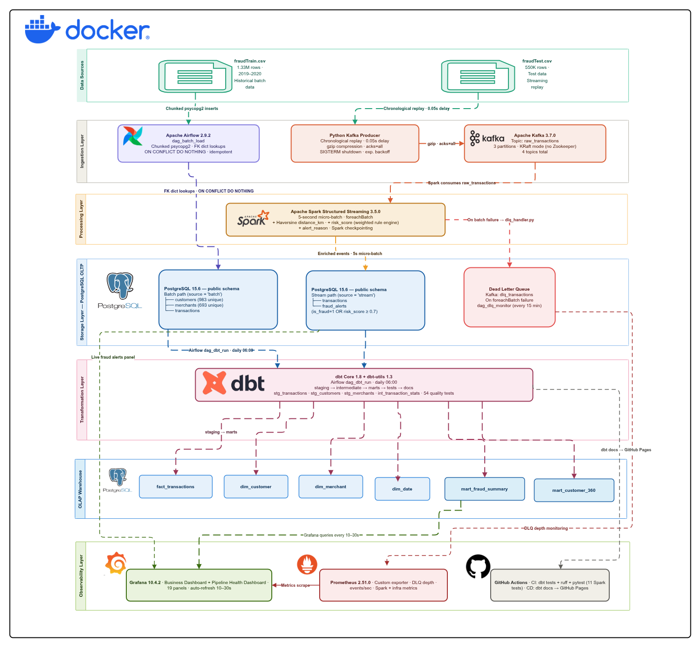

# FraudLens

> Production-grade, fully containerized real-time financial fraud detection and analytics platform —
> detecting fraudulent transactions in under 5 seconds, processing 1.8M transactions across dual
> batch and streaming ingestion paths.

Financial fraud costs the global banking industry over **$40 billion annually**. FraudLens is a
production-aligned data engineering platform that simulates how a real bank detects fraudulent
credit card transactions in real time, while maintaining a complete 2-year historical analytical
warehouse for trend analysis, regulatory reporting, and customer risk profiling.

The platform runs **two parallel ingestion paths** that converge into a single PostgreSQL OLTP
layer. Apache Airflow seeds 2 years of labeled fraud history via bulk batch load. Apache Spark
Structured Streaming replays 550K test transactions in real time, enriching each event with a
computed risk score and a Haversine-computed geographic distance before writing back to the same
warehouse. dbt reads both paths together and builds a unified OLAP star schema. Grafana renders the
full picture on two live dashboards refreshing every 5–30 seconds.

---

## Table of Contents

- [Project Overview](#project-overview)
- [Motivation & Core Problem Solved](#motivation--core-problem-solved)
- [System Architecture](#system-architecture)
- [End-to-End Data Flow](#end-to-end-data-flow)
- [Technologies & Design Decisions](#technologies--design-decisions)
- [Component Breakdown](#component-breakdown)
- [Pipeline Results](#pipeline-results)
- [Quick Start](#quick-start)
- [Execution Workflow](#execution-workflow)
- [Service URLs](#service-urls)
- [Makefile Commands](#makefile-commands)
- [Resilience & Failure Handling](#resilience--failure-handling)
- [CI/CD](#cicd)
- [Project Structure](#project-structure)

---

## Project Overview

FraudLens is built around a single question: *how does a bank actually detect fraud at scale?*

The answer involves two complementary systems working in parallel. The first holds 2 years of
labeled transaction history — analysts use it to identify seasonal trends, high-risk merchant
categories, and customers with elevated fraud rates. The second watches every transaction the moment
it arrives, computes a risk score in seconds, and routes confirmed fraud events to an alert queue
before the customer has left the merchant.

FraudLens implements both systems end-to-end using production-grade open-source tooling, all
deployed on a single machine via Docker Compose with a peak memory footprint under 10 GB.

---

## Motivation & Core Problem Solved

**The Problem:**

Fraud detection in financial institutions requires answering two questions simultaneously:

1. *Right now* — is this specific transaction suspicious? *(streaming, sub-5-second latency)*
2. *Over time* — which customers, merchants, and categories carry the highest systemic risk?
   *(analytical, high accuracy)*

Most demonstration pipelines solve one or the other. A streaming demo shows events flowing through
Kafka but has no historical context to compare against. An analytical warehouse produces clean
dashboards but has no real-time dimension. Neither reflects how the problem is actually solved in
production.

**The Solution:**

FraudLens unifies both in a single platform:

- A **batch ingestion path** seeds 1.33M labeled transactions (2019–2020) using Airflow, giving
  the warehouse 2 full years of ground truth before a single streaming event arrives.
- A **streaming path** replays 550K test transactions through Kafka and Spark, enriching each
  event with a weighted risk score and a geographic distance check, then writing results back to
  the same PostgreSQL layer as the batch data.
- **dbt** reads both paths together and builds a unified OLAP star schema — one definition of
  fraud rate that every dashboard, analyst, and downstream consumer uses consistently.
- **Grafana** renders the full picture: real-time fraud alerts from the OLTP layer and aggregated
  trend analysis from the dbt-built OLAP marts, auto-refreshing every 10–30 seconds.

---

## System Architecture



The system is organized into five horizontal layers:

**Ingestion Layer** — A Python Kafka producer replays `fraudTest.csv` row by row in chronological
order. An Airflow DAG bulk-loads `fraudTrain.csv` via chunked `psycopg2` inserts with FK
resolution.

**Processing Layer** — Spark Structured Streaming consumes `raw_transactions`, computes a
Haversine geographic distance and a weighted risk score per event, and writes enriched results to
PostgreSQL every 5 seconds via `foreachBatch`.

**Storage Layer** — PostgreSQL 15 serves dual roles: the `public` schema is the operational OLTP
layer (transactions, customers, merchants, fraud_alerts); the `fraudlens_dw` schema is the
dbt-built OLAP layer.

**Transformation Layer** — dbt Core rebuilds the full star schema daily: 3 staging views feed 1
intermediate join model, which feeds 4 core mart tables and 2 fraud analytics mart tables.

**Observability Layer** — Prometheus scrapes Kafka, Spark, and a custom Python exporter. Grafana
renders 2 auto-provisioned dashboards. Airflow monitors the Dead Letter Queue every 15 minutes and
alerts if Spark starts dropping events.

---

## End-to-End Data Flow

```
fraudTrain.csv  (1.33M rows · 2019–2020)
       │
       │   Airflow  dag_batch_load
       │   Chunked psycopg2 inserts · FK dict lookups · ON CONFLICT DO NOTHING
       ▼
PostgreSQL OLTP — public schema
       ├── customers      (983 unique)
       ├── merchants      (693 unique)
       └── transactions   source = 'batch'

fraudTest.csv  (550K rows)
       │
       │   Python Kafka Producer
       │   Chronological replay · 0.05s delay · gzip · acks=all
       ▼
Kafka: raw_transactions  (3 partitions)
       │
       │   Spark Structured Streaming
       │   5-second micro-batch · foreachBatch
       │   + Haversine distance_km
       │   + risk_score  (weighted rule engine)
       │   + alert_reason
       ▼
PostgreSQL OLTP
       ├── transactions   source = 'stream'
       └── fraud_alerts   is_fraud = 1  OR  risk_score ≥ 0.7
       │
       │   On batch failure → dlq_handler.py
       ▼
Kafka: dlq_transactions
       │
       │   Airflow  dag_dlq_monitor  (every 15 min)
       ▼
Alert log  →  Slack / PagerDuty in production

PostgreSQL OLTP
       │
       │   Airflow  dag_dbt_run  (daily 06:00)
       │   staging → intermediate → marts → tests → docs
       ▼
PostgreSQL OLAP — fraudlens_dw schema
       ├── fact_transactions
       ├── dim_customer · dim_merchant · dim_date
       ├── mart_fraud_summary
       └── mart_customer_360
       │
       │   Grafana  (queries every 10–30 s)
       ▼
Business Dashboard  +  Pipeline Health Dashboard
```

---

## Technologies & Design Decisions

| Layer | Technology | Version | Role |
|---|---|---|---|
| Message Broker | Apache Kafka (KRaft) | 3.7.0 | 4 topics, no Zookeeper overhead |
| Stream Processing | Apache Spark Structured Streaming | 3.5.0 | Risk scoring, enrichment, PostgreSQL writes |
| Orchestration | Apache Airflow (LocalExecutor) | 2.9.2 | Batch load, dbt scheduling, DLQ monitoring |
| Transformation | dbt Core + dbt-utils | 1.8 / 1.3 | Staging → intermediate → star schema |
| OLTP Storage | PostgreSQL | 15.6 | Operational transactions, customers, merchants, alerts |
| OLAP Storage | PostgreSQL (`fraudlens_dw`) | 15.6 | Analytical warehouse — fact + dims + marts |
| Visualization | Grafana | 10.4.2 | 2 auto-provisioned dashboards, 19 panels |
| Monitoring | Prometheus + Custom Exporter | 2.51.0 | DLQ depth, events/sec, Spark + infra metrics |
| CI | GitHub Actions | — | dbt tests + ruff lint + Spark unit tests on every PR |
| CD | GitHub Actions | — | dbt docs → GitHub Pages on every merge to main |
| Containerization | Docker Compose | — | 12 services · ~9.5 GB peak RAM |

---

## Component Breakdown

### 1. Orchestration — Apache Airflow

Three DAGs cover the full pipeline lifecycle. `dag_batch_load` seeds the OLTP layer and triggers
dbt on completion. `dag_dbt_run` refreshes the OLAP warehouse daily, with staging tests running
before any mart is built. `dag_dlq_monitor` checks DLQ depth every 15 minutes and alerts if Spark
starts dropping events. LocalExecutor is used — no Redis, no Celery, no extra infrastructure.

`dag_batch_load` loads 1.33M historical transactions from `fraudTrain.csv` into PostgreSQL using
chunked reads, FK dict lookups (O(1) per row, 2 DB queries total), `execute_values` bulk inserts,
and `ON CONFLICT DO NOTHING` idempotency. The task order enforces FK constraints at the database
level: customers → merchants → transactions.

→ [airflow/README.md](airflow/README.md)

---

### 2. Streaming Ingestion — Apache Kafka + Python Producer

A Python producer replays `fraudTest.csv` row by row into Kafka in chronological order. Kafka runs
in KRaft mode — no Zookeeper. Four topics handle the full pipeline: `raw_transactions`,
`enriched_transactions`, `fraud_alerts`, and `dlq_transactions`. The producer implements graceful
SIGTERM shutdown, exponential backoff reconnection, gzip compression, and `acks=all`.

→ [kafka/kafka_README.md](kafka/kafka_README.md)

---

### 3. Stream Processing — Apache Spark Structured Streaming

Spark consumes `raw_transactions`, computes a Haversine geographic distance and a weighted
`risk_score` per event, and writes to three PostgreSQL tables every 5 seconds via `foreachBatch`.
Fraud alerts fire when `is_fraud = 1` (ground truth) or `risk_score >= 0.7` (rule engine). Failed
batches are routed to the Dead Letter Queue — nothing is silently dropped.

```
risk_score = (0.4 × amount_score) + (0.4 × distance_score) + (0.2 × category_score)
```

→ [spark/spark_README.md](spark/spark_README.md)

---

### 4. Transformation — dbt

dbt transforms raw OLTP data into a clean, tested, and documented OLAP warehouse. Three staging
views clean and type-cast the source tables. One intermediate model joins all three into a single
enriched fact. Six mart tables — four core star schema tables and two fraud analytics aggregations
— are materialized physically in `fraudlens_dw` for fast Grafana query response. 54 data quality
tests cover every model.

→ [dbt/README.md](dbt/README.md)

---

### 5. Visualization — Grafana

Two dashboards are provisioned automatically from JSON files on container startup. The Business
Dashboard queries the `fraudlens_dw` OLAP schema and shows 2 years of fraud KPIs, daily trend
lines, and a live customer risk table. The Pipeline Health dashboard queries both OLTP and
Prometheus, showing ingestion rates, DLQ status, and active database connections in real time.

→ [monitoring/grafana/README.md](monitoring/grafana/README.md)

---

### 6. Monitoring — Prometheus + Custom Exporter

A custom Python exporter exposes two pipeline-specific metrics on `:8000/metrics`:
`fraudlens_dlq_depth` (unconsumed DLQ messages — should always be 0) and
`fraudlens_events_per_second` (message rate in `raw_transactions` over the last scrape interval).
Prometheus also scrapes Spark Master directly for executor and job-level metrics.

→ [monitoring/grafana/README.md](monitoring/README.md)

---

## Pipeline Results

| Metric | Value |
|---|---|
| Total transactions processed | 1.33 Million |
| Fraud cases detected | 7,651 |
| Overall fraud rate | 0.574% |
| Average fraud amount | $498.20 |
| Stream events processed | 35.6K+ (growing) |
| dbt models built | 10 |
| dbt data quality tests | 54 — all passing |
| Spark micro-batch interval | 5 seconds |
| Unique customers | 983 |
| Unique merchants | 693 |
| DLQ depth | 0 — clean |

---

## Quick Start

### Prerequisites

- Docker Engine 24+
- Git
- 12 GB RAM minimum
- Kaggle account

### 1. Clone and initialize

```bash
git clone https://github.com/keroloshany47/FraudLens.git
cd FraudLens
bash scripts/init_repo.sh
```

### 2. Download the dataset

```bash
pip install kaggle
kaggle datasets download -d kartik2112/fraud-detection -p data/raw/ --unzip
```

Or download manually from
[Kaggle — Sparkov Fraud Detection](https://www.kaggle.com/datasets/kartik2112/fraud-detection)
and place both files in `data/raw/`:

```
data/raw/fraudTrain.csv    # 1.33M rows — batch / historical
data/raw/fraudTest.csv     # 550K rows  — streaming simulation
```

### 3. Start the full stack

```bash
make setup
```

Starts all core services, waits for health checks, and creates all 4 Kafka topics.
Takes 2–3 minutes on first run.

### 4. Load historical data

```bash
make seed
```

Triggers `dag_batch_load` — loads 1.33M transactions into PostgreSQL and automatically fires
`dag_dbt_run` to build the full OLAP warehouse. Monitor at **http://localhost:8082**
(admin / admin).

### 5. Start the streaming pipeline

```bash
# Terminal 1 — Spark streaming job
make spark-submit
# Wait for: "Streaming query started — awaiting termination"

# Terminal 2 — Kafka producer
make stream
```

### 6. Open the dashboards

**http://localhost:3000** — admin / fraudlens123

---

## Execution Workflow

### Automated path

```bash
make setup          # start all services, create Kafka topics
make seed           # load 1.33M historical rows → triggers dbt automatically
make spark-submit   # start Spark Structured Streaming job
make stream         # start Kafka producer
```

### Manual execution

```bash
open http://localhost:8082    # Airflow UI — trigger any DAG manually

docker compose --profile dbt up -d
make dbt-run                  # run all dbt models
make dbt-test                 # run all 54 tests
make dbt-docs                 # serve catalog at http://localhost:8083

make dlq-check                # inspect Dead Letter Queue depth
make status                   # show all container status + URLs
```

---

## Service URLs

| Service | URL | Credentials |
|---|---|---|
| Grafana | http://localhost:3000 | admin / fraudlens123 |
| Airflow | http://localhost:8082 | admin / admin |
| Spark Master | http://localhost:8080 | — |
| Kafka UI | http://localhost:8090 | — |
| Prometheus | http://localhost:9090 | — |
| PostgreSQL | localhost:5433 | fraudlens / fraudlens_secret |
| dbt catalog | http://localhost:8083 | — |

---

## Makefile Commands

```bash
make help           # list all available commands
make setup          # first-time full stack setup
make start          # start all core services
make stop           # stop all services
make seed           # load historical data via Airflow
make stream         # start Kafka producer
make spark-submit   # start Spark streaming job
make dbt-run        # run all dbt models
make dbt-test       # run all 54 dbt tests
make dbt-docs       # generate and serve dbt catalog at :8083
make kafka-topics   # recreate all Kafka topics
make kafka-status   # show topic details and message counts
make dlq-check      # inspect Dead Letter Queue depth
make status         # show all container status + service URLs
make reset          # full teardown — WARNING: deletes all volumes and data
```

---

## Resilience & Failure Handling

**Idempotent batch load** — `ON CONFLICT DO NOTHING` on every `INSERT` makes the batch DAG safe to
re-run after any crash. The final state is identical whether the DAG ran once or ten times.

**Spark checkpointing** — Kafka offset progress is written to disk after every micro-batch. If the
streaming job crashes and restarts, it resumes from the exact committed offset — no messages
reprocessed, no messages lost.

**Dead Letter Queue** — Every `foreachBatch` call wraps the PostgreSQL write in a `try/except`. On
failure, all affected rows are published to `dlq_transactions` with an attached error reason.
Nothing is silently dropped.

**DLQ monitoring** — `dag_dlq_monitor` checks DLQ depth every 15 minutes using Kafka offset
arithmetic. If depth is above zero, the `alert_team` branch fires. A Slack webhook stub is
included — swap the comment block for a live `requests.post` to activate production alerting.

**Airflow retries** — All tasks are configured with 1 automatic retry and a 2–5 minute backoff.
The scheduler persists task state to PostgreSQL, so container restarts resume without losing run
history.

---

## CI/CD

**CI** runs on every pull request:
- `dbt parse` + `dbt test` against a real PostgreSQL service container
- `ruff check` on all Python source files
- `pytest` on 11 Spark unit tests — fraud scorer, Haversine, and alert reason builder

**CD** runs on every merge to `main`:
- `dbt docs generate` builds the full data catalog
- Published automatically to GitHub Pages

Live data catalog: **https://keroloshany47.github.io/FraudLens**

---

## Project Structure

```
FraudLens/
├── airflow/
│   ├── dags/
│   │   ├── dag_batch_load.py      # 1.33M CSV → OLTP, idempotent, triggers dbt
│   │   ├── dag_dbt_run.py         # daily OLAP refresh with quality gates
│   │   └── dag_dlq_monitor.py     # DLQ depth check every 15 minutes
│   └── README.md
├── dbt/
│   ├── models/
│   │   ├── staging/               # stg_transactions · stg_customers · stg_merchants
│   │   ├── intermediate/          # int_transaction_stats
│   │   └── marts/
│   │       ├── core/              # fact_transactions · dim_* tables
│   │       └── fraud/             # mart_fraud_summary · mart_customer_360
│   ├── macros/
│   └── README.md
├── kafka/
│   ├── producer/
│   │   └── stream_producer.py
│   ├── topics/
│   │   └── create_topics.sh
│   └── kafka_README.md
├── spark/
│   ├── jobs/
│   │   ├── stream_processor.py
│   │   └── utils/
│   │       ├── fraud_scorer.py
│   │       ├── geo_utils.py
│   │       └── dlq_handler.py
│   ├── tests/
│   │   └── test_fraud_scorer.py   # 11 unit tests
│   └── spark_README.md
├── monitoring/
│   ├── exporter/
│   │   └── fraudlens_exporter.py
│   │
│   ├── grafana/
│   │   ├── provisioning/
│   │   │   ├── datasources/
│   │   │   │   └── datasources.yaml
│   │   │   └── dashboards/
│   │   │       └── dashboards.yaml
│   │   └──  dashboards/
│   │           ├── business.json
│   │           └── pipeline_health.json
│   ├── prometheus/
│   │    └── prometheus.yml
│   └── README.md
├── infra/
│   └── docker/postgres/init/
│       └── 01_schema.sql
├── docs/
│   └── decisions/
│       ├── ADR-001-kafka-kraft.md
│       ├── ADR-002-microbatch.md
│       └── ADR-003-postgres-olap.md
├── .github/
│   └── workflows/
│       ├── ci.yml
│       └── cd.yml
├── Img/
├── data/raw/
├── scripts/
│   └── init_repo.sh
├── docker-compose.yml
├── Makefile
├── .env.example
└── README.md
```

---

## Data Source

[Sparkov Credit Card Fraud Detection](https://www.kaggle.com/datasets/kartik2112/fraud-detection)
— 1.85M synthetic transactions covering 1,000 customers and 800 merchants across 2019–2020.
Fraud rate: 0.52%. 23 features per transaction.

`fraudTrain.csv` feeds the batch historical path. `fraudTest.csv` is replayed as a live stream.

---

*Architecture decisions → [`docs/decisions/`](docs/decisions/)  
Live dbt catalog → [GitHub Pages](https://keroloshany47.github.io/FraudLens)*
