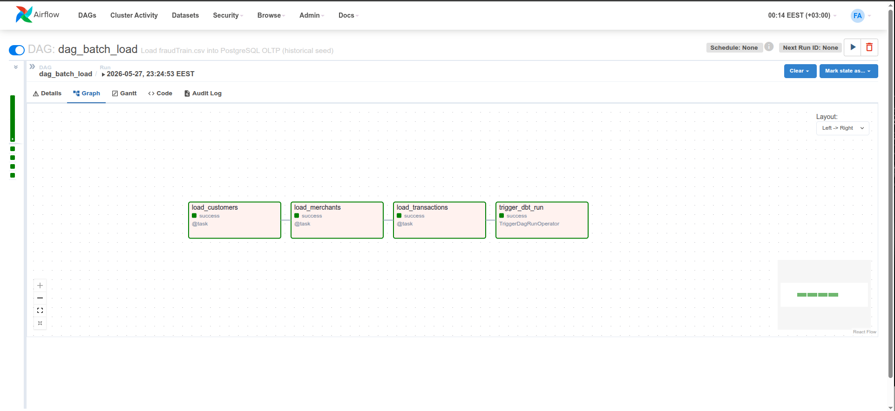
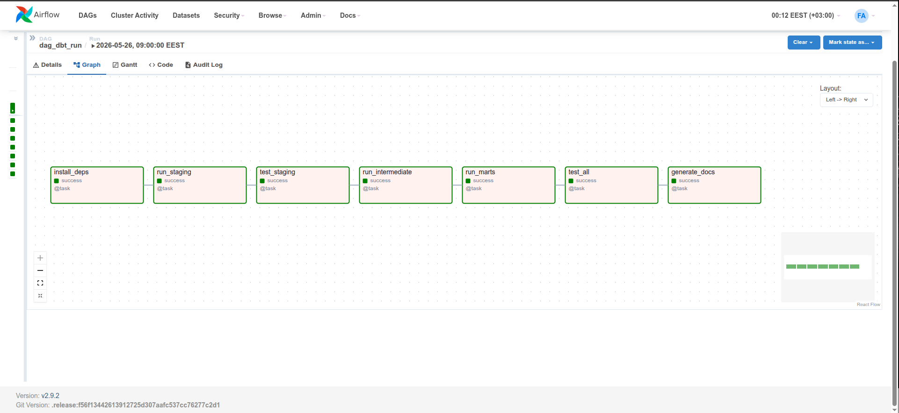
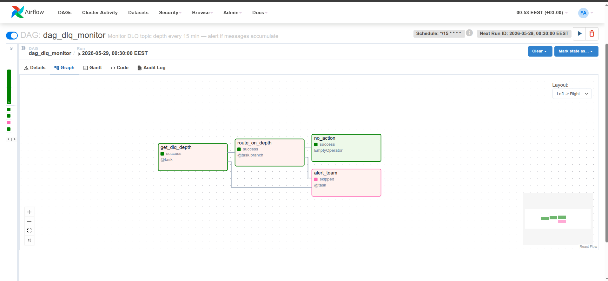

# Airflow — Orchestration Layer

Apache Airflow orchestrates everything in FraudLens that runs on a schedule or depends on another
job completing first. Without orchestration, the batch load, the dbt refresh, and the DLQ monitor
are three scripts you run manually and hope finish in the right order. Airflow turns them into a
managed dependency graph with automatic retries, execution history, and a web UI that shows exactly
which task failed and why — without anyone watching a terminal.

---

## Table of Contents

- [Why Airflow](#why-airflow)
- [Why LocalExecutor](#why-localexecutor)
- [DAG Overview](#dag-overview)
- [DAG 1 — dag_batch_load](#dag-1--dag_batch_load)
- [DAG 2 — dag_dbt_run](#dag-2--dag_dbt_run)
- [DAG 3 — dag_dlq_monitor](#dag-3--dag_dlq_monitor)
- [Setup & Access](#setup--access)
- [Useful Commands](#useful-commands)
- [Folder Structure](#folder-structure)

---

## Why Airflow

A pipeline without orchestration is a collection of scripts. Scripts don't retry themselves when
they fail. They don't log which step failed, at what time, or with what error. They don't enforce
that step B only runs after step A has successfully completed. They don't alert you when something
goes wrong at 3am.

Airflow solves all of this. Every task in FraudLens is a node in a directed acyclic graph. Airflow
tracks state (queued, running, success, failed, skipped), retries on failure, sends the failure
reason to the log, and enforces the dependency chain. When the batch load crashes halfway through
the transaction insert, Airflow retries it automatically and logs exactly which chunk failed — the
engineer wakes up to a clear error, not a silent half-loaded table.

Airflow also provides XCom — a lightweight inter-task communication store — which the DLQ monitor
uses to pass the queue depth value between tasks without any external database or file.

---

## Why LocalExecutor

FraudLens uses **LocalExecutor** instead of CeleryExecutor or KubernetesExecutor.

CeleryExecutor distributes tasks across worker nodes via a Redis or RabbitMQ message broker.
KubernetesExecutor spins up a pod per task. Both add meaningful infrastructure overhead —
additional services, additional networking, additional failure modes.

LocalExecutor runs tasks as subprocesses on the same machine as the scheduler. It requires no
extra infrastructure and handles FraudLens's workload comfortably: at most 3 DAGs, 7 tasks, no
concurrent heavy computation (the heavy work lives in Spark and psycopg2). Keeping the executor
local also keeps the container footprint small and the resource budget predictable.

---

## DAG Overview

| DAG | Schedule | Trigger | Purpose |
|---|---|---|---|
| `dag_batch_load` | None (manual) | `make seed` or Airflow UI | Load 1.33M historical transactions, trigger dbt |
| `dag_dbt_run` | `0 6 * * *` (daily 06:00) | Automatic + triggered by batch load | Refresh OLAP warehouse, run tests, generate docs |
| `dag_dlq_monitor` | `*/15 * * * *` (every 15 min) | Automatic | Check DLQ depth, alert if Spark is dropping events |

All three DAGs start **paused** by default. Toggle the switch in the Airflow UI or use the CLI to
activate them. `dag_batch_load` should always be triggered manually — do not put it on a schedule.

---

## DAG 1 — dag_batch_load

Loads `fraudTrain.csv` into the PostgreSQL OLTP layer. This is the historical seed that gives the
analytical warehouse 2 years of ground truth before streaming begins.



### Task chain

```
load_customers → load_merchants → load_transactions → trigger_dbt_run
```

This order is not arbitrary. PostgreSQL enforces foreign key constraints at insert time:
`transactions` references both `customers` and `merchants`. If a transaction row references a
`customer_id` that does not exist yet, PostgreSQL rejects the insert. The DAG enforces the correct
order automatically.

### Key engineering decisions

**Chunked CSV reads (`chunksize=10,000`)**

The CSV is 1.33M rows. Loading it entirely into RAM would consume several GB and risk OOM-killing
the Airflow scheduler. `pandas.read_csv(..., chunksize=10_000)` streams the file in 10K-row blocks
— at most 10K rows live in memory at any moment, and each chunk is committed to PostgreSQL before
the next is read.

**FK dict lookups — O(1) per row, 2 queries total**

`transactions` rows need `customer_id` and `merchant_id` — surrogate keys that don't exist in
the CSV. The naive approach queries the database once per row: 1.33M queries. Instead, the DAG
builds two Python dicts after the dimension tables are loaded:

```python
cur.execute("SELECT cc_num, customer_id FROM customers")
cc_map = {row[0]: row[1] for row in cur.fetchall()}

cur.execute("SELECT merchant_name, merchant_id FROM merchants")
merch_map = {row[0]: row[1] for row in cur.fetchall()}
```

Each transaction row then resolves its FKs via `cc_map.get(cc_num)` — an O(1) dict lookup.
1.33M O(1) lookups vs 1.33M database round-trips.

**`execute_values` with `page_size=2000`**

`psycopg2.extras.execute_values` constructs one SQL statement with 2,000 value tuples per call
rather than one statement per row. For the transaction table this reduces the number of SQL
round-trips from 1.33M to ~665 — roughly 100× fewer network calls to PostgreSQL.

**`ON CONFLICT DO NOTHING` — full idempotency**

Every `INSERT` across all three tables uses `ON CONFLICT DO NOTHING`. If the DAG crashes mid-run
and is restarted, it produces the same final state as a clean run — no duplicates, no errors, no
manual cleanup needed.

**Auto-trigger dbt**

The final task `trigger_dbt_run` uses `TriggerDagRunOperator` to fire `dag_dbt_run` immediately
after the transaction load completes. The OLAP warehouse is rebuilt automatically — no manual step
needed after seeding.

### Running

```bash
make seed
# or
docker exec fraudlens-airflow-scheduler airflow dags trigger dag_batch_load
```

---

## DAG 2 — dag_dbt_run

Runs the full dbt transformation pipeline on a daily schedule to refresh the analytical warehouse
with any new data that arrived overnight via the streaming path.



### Task chain

```
install_deps → run_staging → test_staging → run_intermediate → run_marts → test_all → generate_docs
```

### Why test before run?

The order is intentional: `test_staging` runs *after* staging models are built but *before* any
intermediate or mart model is constructed on top of them.

If overnight stream inserts produced broken records — null `trans_id`, negative amounts, invalid
`is_fraud` values — the staging tests surface this before any mart is built on top of bad data.
A broken mart that silently produces wrong numbers on the Grafana dashboard is worse than no data
at all. The tests act as a quality gate: the pipeline stops and alerts rather than propagating
corrupt data downstream.

### Task breakdown

| Task | dbt command | What it does |
|---|---|---|
| `install_deps` | `dbt deps` | Installs dbt-utils package before any model runs |
| `run_staging` | `dbt run --select staging` | Builds the 3 staging views |
| `test_staging` | `dbt test --select staging` | Runs 18 staging tests — uniqueness, not-null, accepted values |
| `run_intermediate` | `dbt run --select intermediate` | Builds `int_transaction_stats` view |
| `run_marts` | `dbt run --select marts` | Builds all 6 mart tables in `fraudlens_dw` |
| `test_all` | `dbt test` | Runs all 54 tests across every model |
| `generate_docs` | `dbt docs generate` | Rebuilds the data catalog (published to GitHub Pages via CD) |

### dbt binary discovery

The DAG locates the dbt binary dynamically using `shutil.which` and a list of known install paths.
This makes the task portable across different Airflow image configurations without hardcoding a
path that may change when the container is rebuilt.

### Schedule

Runs at **06:00 every day**. Change the cron expression in `dag_dbt_run.py` or via an environment
variable if a different refresh window is needed.

---

## DAG 3 — dag_dlq_monitor

Monitors the `dlq_transactions` Kafka topic every 15 minutes. If any messages have accumulated
since the last check, the DAG logs a prominent error. In production, swap the log line for an HTTP
call to Slack or PagerDuty.



### Task chain

```
get_dlq_depth → route_on_depth → alert_team
                              └→ no_action
```

### How it measures depth

Kafka stores messages as an ordered log with numeric offsets. The monitor reads the end offset
(latest write position) minus the beginning offset (oldest retained message). The difference is
the number of messages currently sitting in the topic — written by Spark's DLQ handler and never
consumed:

```python
consumer.seek_to_end(tp)
end_offset = consumer.position(tp)

consumer.seek_to_beginning(tp)
begin_offset = consumer.position(tp)

depth = end_offset - begin_offset
```

The consumer uses `group_id=None` — it does not join any consumer group, so it doesn't affect
consumer lag tracking or committed offsets.

### XCom — inter-task communication

`get_dlq_depth` returns the depth integer. Airflow's TaskFlow API automatically stores this
return value in XCom and passes it as an argument to both `route_on_depth` and `alert_team`.
No external database or file is needed for inter-task value passing.

### BranchOperator

`route_on_depth` is decorated with `@task.branch`. It returns either `"alert_team"` or
`"no_action"` as a string — Airflow runs only the matching downstream task and marks the other
as skipped. This is visible in the graph view as the pink (skipped) vs green (success) coloring.

### Production alerting

The `alert_team` task contains a commented Slack webhook stub:

```python
# import requests, os
# webhook = os.environ["SLACK_WEBHOOK_URL"]
# requests.post(webhook, json={"text": f":red_circle: DLQ has {depth} messages"})
```

Uncomment, set the environment variable, and the monitor becomes a live production alert.

---

## Setup & Access

Airflow initializes automatically when `make setup` runs. The admin user is created by
`airflow-init` on first start:

| Field | Value |
|---|---|
| URL | http://localhost:8082 |
| Username | admin |
| Password | admin |

If you need to reinitialize manually:

```bash
docker exec fraudlens-airflow-scheduler airflow db migrate
docker exec fraudlens-airflow-scheduler airflow users create \
  --username admin --role Admin \
  --firstname FraudLens --lastname Admin \
  --email admin@fraudlens.io --password admin
```

---

## Useful Commands

```bash
# Trigger the batch load
make seed

# List all DAGs and their pause state
docker exec fraudlens-airflow-scheduler airflow dags list

# Trigger any DAG manually
docker exec fraudlens-airflow-scheduler airflow dags trigger dag_batch_load
docker exec fraudlens-airflow-scheduler airflow dags trigger dag_dbt_run
docker exec fraudlens-airflow-scheduler airflow dags trigger dag_dlq_monitor

# Check task logs for the last run
docker exec fraudlens-airflow-scheduler \
  airflow tasks logs dag_batch_load load_transactions -1
```

---

## Folder Structure

```
airflow/
├── dags/
│   ├── dag_batch_load.py      # 1.33M CSV → OLTP, idempotent, triggers dbt
│   ├── dag_dbt_run.py         # daily OLAP refresh with quality gates
│   └── dag_dlq_monitor.py     # DLQ depth check every 15 minutes
├── logs/                      # auto-generated by Airflow (gitignored)
├── plugins/                   # empty — no custom plugins needed
├── requirements.txt           # kafka-python + psycopg2-binary
└── README.md
```

---

*Back to root → [README.md](../README.md)*  
*Related → [spark/spark_README.md](../spark/spark_README.md) · [dbt/README.md](../dbt/README.md)*