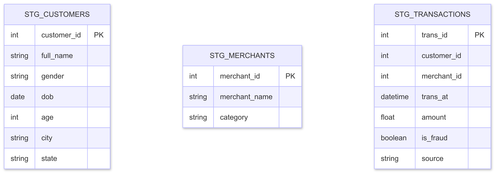
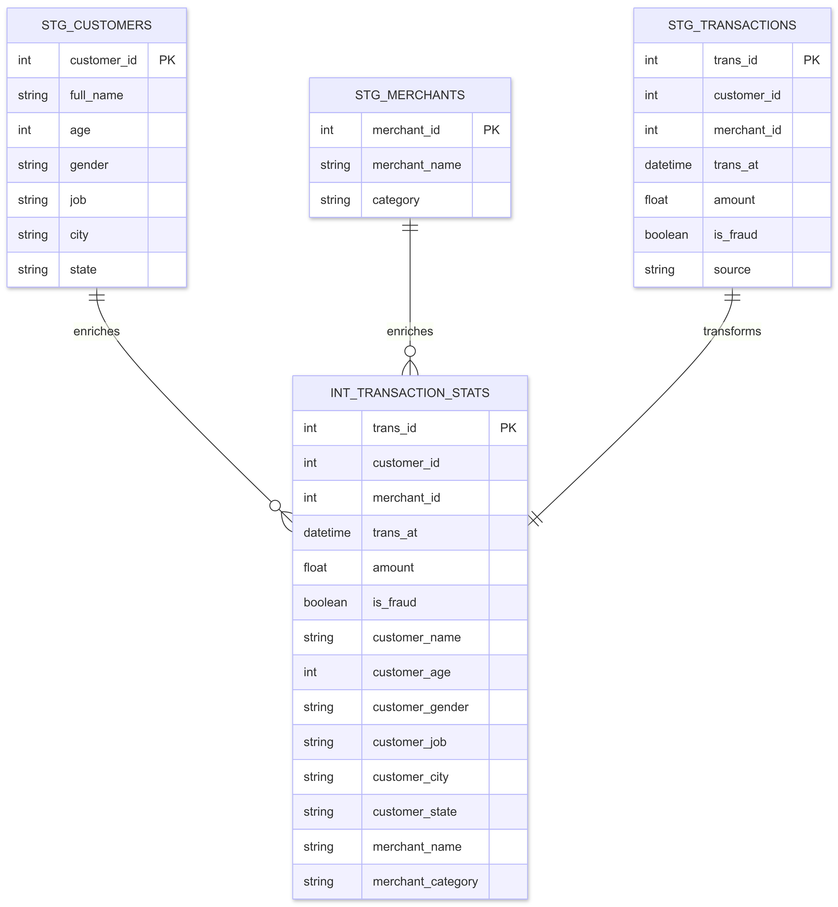
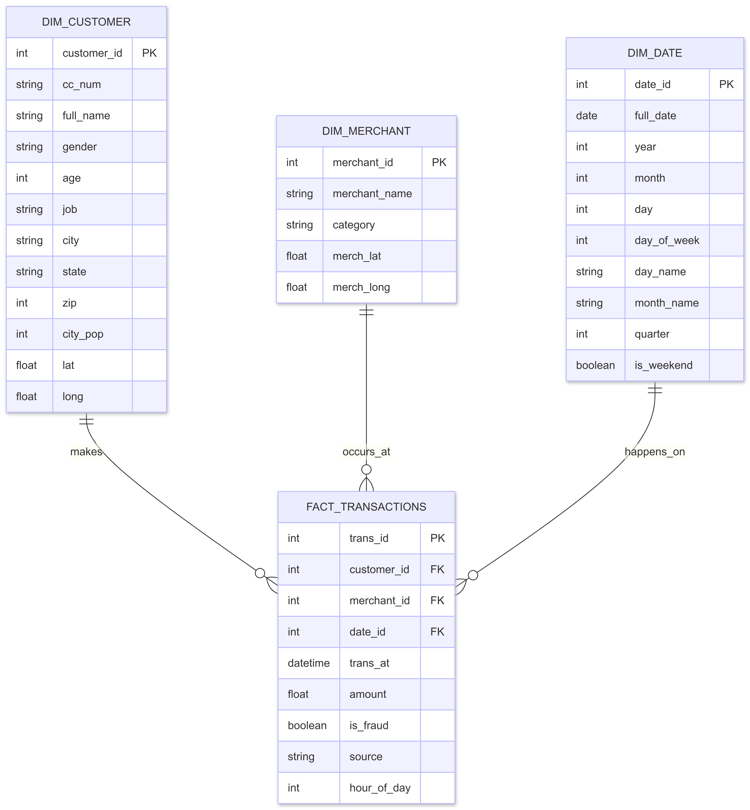
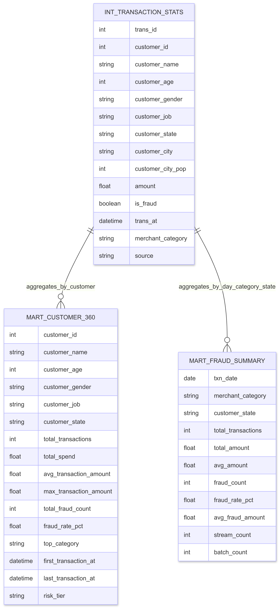
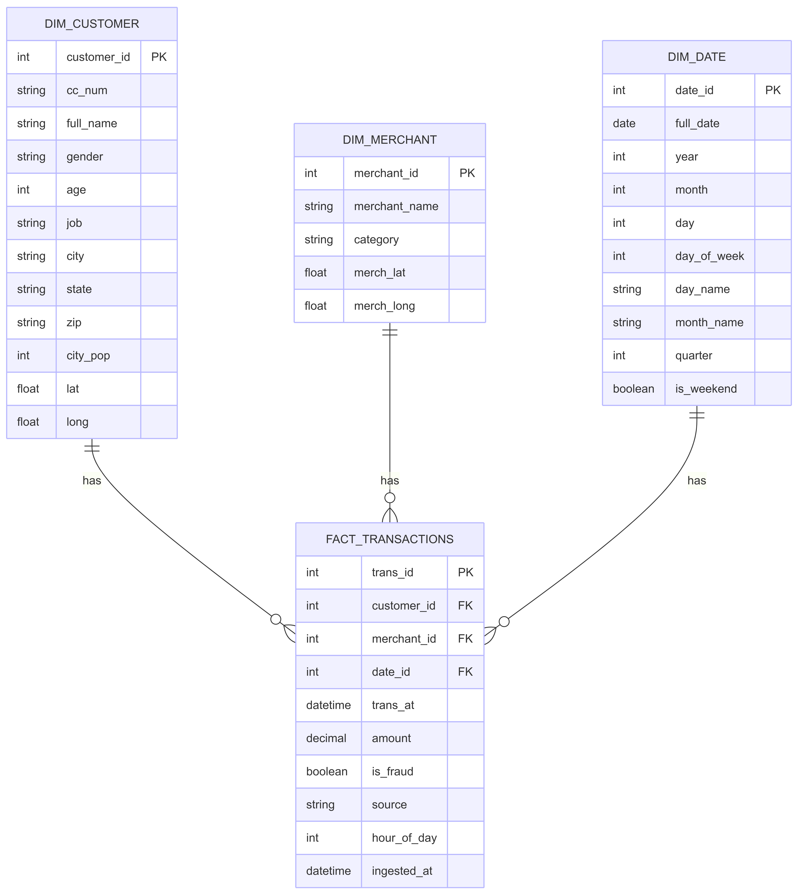
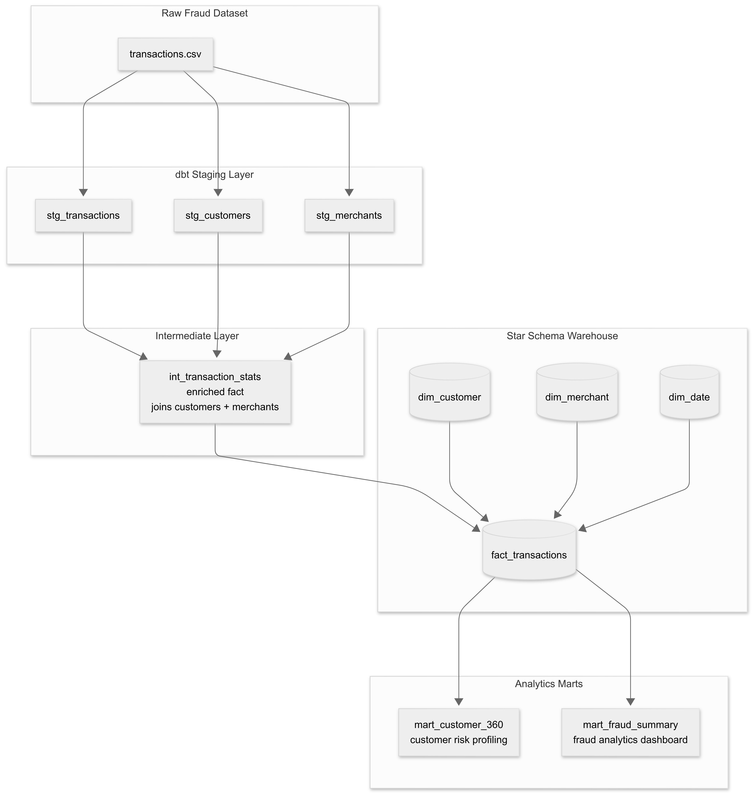

# dbt — Transformation Layer

dbt transforms raw operational data from the PostgreSQL OLTP layer into a clean, tested, and
documented analytical warehouse. It does not move data or run its own compute engine — it reads
what Airflow and Spark already loaded and rebuilds it into versioned SQL models that Grafana and
analysts query directly.

---

## Table of Contents

- [Why dbt](#why-dbt)
- [Architecture](#architecture)
- [Layer 1 — Staging](#layer-1--staging)
- [Layer 2 — Intermediate](#layer-2--intermediate)
- [Layer 3 — Marts](#layer-3--marts)
- [Star Schema](#star-schema)
- [Materialisation Strategy](#materialisation-strategy)
- [Data Quality Tests](#data-quality-tests)
- [The generate_schema_name Macro](#the-generate_schema_name-macro)
- [Lineage Graph](#lineage-graph)
- [Running dbt](#running-dbt)
- [Data Catalog](#data-catalog)
- [Folder Structure](#folder-structure)

---

## Why dbt

Without dbt, every analyst writes their own version of the same join. One person computes fraud
rate as `fraud / total`. Another computes it as `fraud / (total - nulls)`. A third filters out
weekends. The numbers on three dashboards never match, and no one knows which one is right.

dbt solves this by making every transformation version-controlled, peer-reviewed, and shared. There
is one definition of fraud rate — it lives in `mart_fraud_summary.sql`, it is tested, it is
documented, and every downstream consumer uses the same number.

dbt also generates a **data catalog** automatically. Every model, column, test, and lineage
relationship is documented and browsable at a URL without any additional tooling. This is what
companies pay Atlan or Alation thousands of dollars for — dbt gives it as part of `dbt docs serve`.

---

## Architecture

```
PostgreSQL OLTP — public schema
    transactions · customers · merchants · fraud_alerts
              │
              │  dbt reads via sources.yml
              ▼
    ┌────────────────────────┐
    │  Staging  (views)      │   stg_transactions
    │                        │   stg_customers
    │                        │   stg_merchants
    └───────────┬────────────┘
                │
                ▼
    ┌────────────────────────┐
    │  Intermediate  (view)  │   int_transaction_stats
    │                        │   (3-way enriched join)
    └───────────┬────────────┘
                │
                ▼
    ┌──────────────────────────────────────────────┐
    │  Marts  (tables — fraudlens_dw schema)       │
    │                                              │
    │  core/                                       │
    │    fact_transactions   (star center)         │
    │    dim_customer                              │
    │    dim_merchant                              │
    │    dim_date                                  │
    │                                              │
    │  fraud/                                      │
    │    mart_fraud_summary                        │
    │    mart_customer_360                         │
    └──────────────────────────────────────────────┘
                │
                │  Grafana queries here
                ▼
    Business Dashboard  +  Pipeline Health Dashboard
```

---

## Layer 1 — Staging

Staging models read directly from OLTP source tables. They do nothing except clean, type-cast, and
rename. There is no business logic, no aggregation, and no join at this layer. Each model is a
single `SELECT` with light transformations.



### stg_transactions

Source: `public.transactions` — written by both Airflow (batch) and Spark (stream).

Key transformations:
- `extract(hour from trans_at)` → `hour_of_day` integer
- `extract(dow from trans_at)` → `day_of_week` integer (0 = Sunday)
- Weekend flag derived from `day_of_week`
- Rows with null `trans_id` are dropped

The `source` column (`'batch'` or `'stream'`) passes through unchanged — every downstream model
can filter or group by ingestion path without rejoining the source.

### stg_customers

Source: `public.customers` — written by `dag_batch_load`.

Key transformations:
- `first_name || ' ' || last_name` → `full_name`
- `date_part('year', age(dob::date))::integer` → `age` (derived at query time, always current)
- Rows with null `cc_num` are dropped

Age is derived here rather than stored in OLTP. Every downstream model gets a consistent age
calculation — no risk of stale values from a column that was computed once at insert time.

### stg_merchants

Source: `public.merchants` — written by `dag_batch_load`.

Key transformations:
- `lower(trim(category))` — normalises merchant category to lowercase with underscores
- Rows with null `merchant_name` are dropped

---

## Layer 2 — Intermediate

The intermediate layer joins staging models together and computes derived columns that multiple mart
models need. Building this join once — rather than repeating it in every mart — keeps the mart SQL
clean and ensures consistent results.



### int_transaction_stats

Joins `stg_transactions`, `stg_customers`, and `stg_merchants` into one enriched row per
transaction. This is the **single source of truth** for all mart models — both `mart_fraud_summary`
and `mart_customer_360` read from `int_transaction_stats`, not directly from staging.

```sql
from transactions t
left join customers c on t.customer_id = c.customer_id
left join merchants m on t.merchant_id = m.merchant_id
```

`LEFT JOIN` is used rather than `INNER JOIN` because stream-path transactions have null
`customer_id` and `merchant_id` — FK resolution is not performed by Spark in the current pipeline
version. An `INNER JOIN` would silently drop all streaming rows from the marts.

---

## Layer 3 — Marts

Mart models are the final analytical layer. They are materialized as **tables** in the
`fraudlens_dw` schema for fast Grafana query response — 1.33M rows behind a view would be too
slow for a dashboard panel refreshing every 30 seconds.

### Core Star Schema



#### fact_transactions

The central fact table. One row per transaction with foreign key references to all three dimension
tables. Grafana joins this with `dim_*` tables for detailed analysis.

Joins `int_transaction_stats` with `dim_date` on `date_trunc('day', trans_at)::date = full_date`
to resolve the `date_id` foreign key.

Stream-path rows have `NULL` `customer_id` and `merchant_id` — documented in `_core.yml`.

#### dim_customer

One row per unique credit card holder. Passes through all descriptive attributes from
`stg_customers`: `cc_num`, `full_name`, `gender`, `age`, `job`, `city`, `state`, `zip`,
`city_pop`, `lat`, `long`.

#### dim_merchant

One row per unique merchant. Passes through `merchant_name`, `category`, `merch_lat`, `merch_long`
from `stg_merchants`.

#### dim_date

One row per calendar day from 2019-01-01 to 2021-12-31, generated with `generate_series`:

```sql
select generate_series(
    '2019-01-01'::date,
    '2021-12-31'::date,
    '1 day'::interval
)::date as full_date
```

This covers the full Sparkov dataset range with 1 year of buffer. Generated via SQL — it never
needs a CSV seed file and never needs updating.

### Fraud Analytics Marts



#### mart_fraud_summary

Daily fraud metrics grouped by merchant category and customer state. The primary model for the
Grafana Business Dashboard.

Grafana queries this for:
- Daily fraud rate over time (line chart — the 2-year trend)
- Fraud rate by merchant category (donut chart)
- Total transactions, total fraud cases, overall fraud rate % (stat panels)
- Transaction volume by day (bar chart)

Key metric: `fraud_rate_pct`

```sql
round(
    sum(is_fraud)::numeric
    / nullif(count(*), 0) * 100,
    4
) as fraud_rate_pct
```

`NULLIF(count(*), 0)` prevents division-by-zero on days or category+state combinations with no
transactions.

The model also tracks `stream_count` and `batch_count` per row, making it possible to compare
batch vs streaming ingestion volumes in the same query.

#### mart_customer_360

Per-customer risk profile aggregated across all their transactions. "360" means a complete view of
the customer from all angles — spending behavior, fraud exposure, top category, date range, and a
derived risk tier.

```sql
case
    when sum(is_fraud)::numeric / nullif(count(*), 0) > 0.05 then 'HIGH'
    when sum(is_fraud)::numeric / nullif(count(*), 0) > 0.01 then 'MEDIUM'
    else 'LOW'
end as risk_tier
```

`mode() within group (order by merchant_category)` returns the most frequent merchant category
for each customer — the PostgreSQL ordered-set aggregate function.

Grafana uses this for the "Top 10 High-Risk Customers" table, sorted by `fraud_rate_pct DESC`.

---

## Star Schema





The star schema in `fraudlens_dw` follows the Kimball methodology: one central fact table
surrounded by dimension tables, with no joins between dimensions. Grafana can answer any analytical
question about the dataset with a single join from `fact_transactions` to the relevant dimension.

---

## Materialisation Strategy

| Layer | Materialisation | Schema | Reason |
|---|---|---|---|
| Staging | `view` | `public` | Always fresh, zero storage cost, rebuilt instantly on every query |
| Intermediate | `view` | `public` | Same — no value in storing an intermediate join |
| Core marts | `table` | `fraudlens_dw` | Stored physically — Grafana refreshes every 10–30s on 1.33M rows |
| Fraud marts | `table` | `fraudlens_dw` | Same — aggregations are cheap to build, expensive to recompute per query |

---

## Data Quality Tests

54 tests run automatically in CI on every pull request and daily in Airflow before mart models are
built. They cover every model across all four test types:

| Test type | Count | What it checks |
|---|---|---|
| `not_null` | 22 | Required columns never contain nulls |
| `unique` | 16 | Primary keys and natural keys are never duplicated |
| `accepted_values` | 8 | `is_fraud` ∈ {0,1}, `source` ∈ {'batch','stream'}, `risk_tier` ∈ {'HIGH','MEDIUM','LOW'} |
| `accepted_range` (dbt-utils) | 8 | Amounts 0–50K, ages 18–110, fraud rate 0–100 |

All 54 tests pass on the loaded dataset.

**Results on an empty database:** 54/54 pass (tests handle empty tables gracefully).  
**Results after batch load:** re-run `dbt test` — any data quality issues in the CSV surface here
before a single mart is built on top of bad data.

---

## The generate_schema_name Macro

dbt's default behaviour is to prefix the target schema to custom schema names. With
`target.schema = 'public'` and `+schema: fraudlens_dw`, the default would produce
`public_fraudlens_dw` — not `fraudlens_dw`.

The macro in `macros/generate_schema_name.sql` overrides this:

```sql

    
        {{ target.schema }}
    
        {{ custom_schema_name | trim }}
    

```

When a custom schema is specified, it is used exactly as written — no prefix. Mart tables land
directly in `fraudlens_dw`.

---

## Lineage Graph

The dbt lineage graph shows the full data flow from OLTP source tables through staging, intermediate,
and marts, with every dependency relationship visible as a directed edge.


Green nodes (left) are OLTP source tables. Teal nodes are dbt models. The fan-in from three source
tables through `int_transaction_stats` and the fan-out to the mart layer is clearly visible.

The lineage graph is auto-generated by `dbt docs generate` and is browsable at
**http://localhost:8083** after running `make dbt-docs`.

---

## Running dbt

```bash
# Start the dbt container
docker compose --profile dbt up -d

# Install packages (dbt-utils)
make dbt-run

# Run all models (staging → intermediate → marts)
docker compose exec dbt dbt run --profiles-dir . --target dev

# Run all 54 data quality tests
make dbt-test

# Run a specific model and its dependencies
docker compose exec dbt dbt run --profiles-dir . --select mart_fraud_summary+

# Generate and serve the data catalog
make dbt-docs
```

Or use Makefile shortcuts:

```bash
make dbt-run      # run all models
make dbt-test     # run all 54 tests
make dbt-docs     # generate and serve catalog at http://localhost:8083
```

---

## Data Catalog

After running `dbt docs generate`, a full data catalog is available at **http://localhost:8083**.
It includes:

- Every model with its SQL and description
- Every column with its description and test results
- The full lineage graph
- Test pass/fail status per column

The CD workflow (`cd.yml`) regenerates and publishes this catalog to GitHub Pages on every merge
to main.

Live catalog: **https://keroloshany47.github.io/FraudLens**

---

## Folder Structure

```
dbt/
├── dbt_project.yml            # project config, materialisations, schema assignments
├── profiles.yml               # database connections (dev + ci targets)
├── packages.yml               # dbt-utils >=1.0.0 <2.0.0
├── package-lock.yml           # pinned to dbt-utils 1.3.3
├── Dockerfile                 # python:3.11-slim + dbt-postgres==1.8.0
├── macros/
│   └── generate_schema_name.sql   # prevents schema prefix doubling
├── models/
│   ├── staging/
│   │   ├── sources.yml            # registers OLTP tables as dbt sources
│   │   ├── _staging.yml           # column docs + 18 tests
│   │   ├── stg_transactions.sql
│   │   ├── stg_customers.sql
│   │   └── stg_merchants.sql
│   ├── intermediate/
│   │   ├── _intermediate.yml      # column docs + 4 tests
│   │   └── int_transaction_stats.sql
│   └── marts/
│       ├── core/
│       │   ├── _core.yml          # column docs + 16 tests
│       │   ├── fact_transactions.sql
│       │   ├── dim_customer.sql
│       │   ├── dim_merchant.sql
│       │   └── dim_date.sql
│       └── fraud/
│           ├── _fraud.yml         # column docs + 16 tests
│           ├── mart_fraud_summary.sql
│           └── mart_customer_360.sql
├── seeds/                     # empty — data loaded via Airflow, not seeds
├── tests/                     # empty — all tests defined inline in yml files
└── README.md
```

---

*Back to root → [README.md](../README.md)*  
*Related → [airflow/README.md](../airflow/README.md) · [monitoring/grafana/README.md](../monitoring/grafana/README.md)*