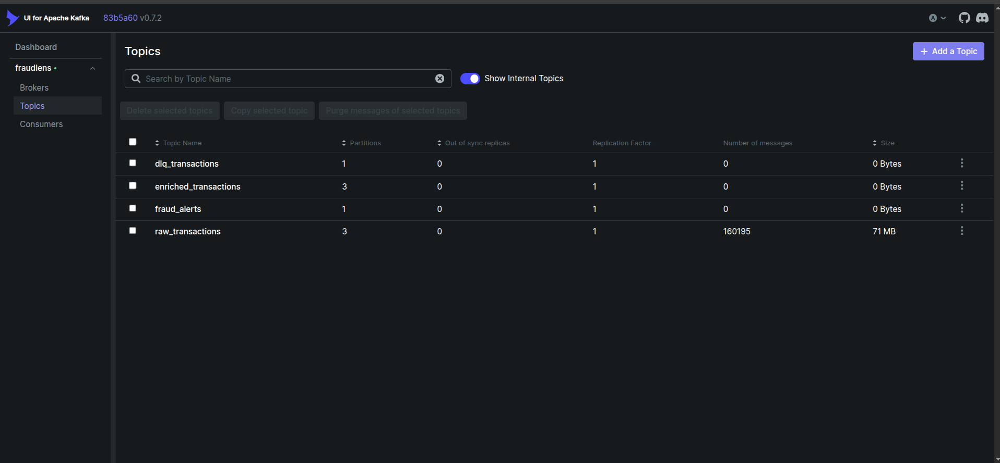

# Kafka — Streaming Ingestion Layer

Apache Kafka is the message broker that decouples the transaction producer from the Spark stream
processor. The Python producer writes as fast as it can without caring whether Spark is ready. Spark
reads at its own pace without caring whether the producer is running. Kafka holds the messages in
between — durably, in order, and with configurable retention — so neither side can lose data even if
the other crashes.

---

## Table of Contents

- [Why Kafka](#why-kafka)
- [Why KRaft — No Zookeeper](#why-kraft--no-zookeeper)
- [Topic Design](#topic-design)
- [The Python Producer](#the-python-producer)
- [Dead Letter Queue](#dead-letter-queue)
- [Topic Setup](#topic-setup)
- [Monitoring the Broker](#monitoring-the-broker)
- [Useful Commands](#useful-commands)
- [Folder Structure](#folder-structure)

---

## Why Kafka

Without Kafka, the Python producer would write directly to PostgreSQL or hand rows directly to
Spark. Both create tight coupling. If Spark is slow, the producer backs up. If the producer
restarts, Spark has no way to replay missed events. If PostgreSQL is under load, everything stalls.

Kafka breaks this coupling entirely. The producer writes to a Kafka topic and moves on. Spark reads
from the same topic at its own pace, using committed offsets to track exactly where it left off.
If Spark crashes and restarts, it resumes from the last committed offset — no messages lost, no
duplicates. If the producer runs faster than Spark can consume, messages accumulate in the topic
and are consumed when Spark catches up. The two sides are completely independent.

Kafka also provides durability. Messages are written to disk and retained for 48 hours by default.
This means the streaming dataset can be replayed from the beginning at any time — useful for
debugging, for testing new processing logic, or for reprocessing after a schema change.

---

## Why KRaft — No Zookeeper

Historically, Kafka required a separate Apache Zookeeper cluster to manage broker metadata, leader
election, and configuration storage. Zookeeper is a separate service to deploy, monitor, and
maintain. It has its own port, its own logs, its own failure modes, and its own memory footprint.

Since Kafka 3.3, **KRaft** (Kafka Raft metadata protocol) is production-stable. The broker handles
its own metadata via an internal Raft consensus implementation — no Zookeeper needed. One fewer
service, one fewer network dependency, one fewer thing that can go wrong.

In `docker-compose.yml`, the Kafka container runs with:

```yaml
KAFKA_PROCESS_ROLES: broker,controller
KAFKA_CONTROLLER_QUORUM_VOTERS: 1@kafka:9093
```

The same container acts as both the Kafka broker and the Raft controller. For a single-node
development setup this is the cleanest possible configuration.

---

## Topic Design

FraudLens uses 4 topics covering the complete pipeline lifecycle:



| Topic | Partitions | Replication | Purpose |
|---|---|---|---|
| `raw_transactions` | 3 | 1 | Raw JSON events from the Python producer |
| `enriched_transactions` | 3 | 1 | Spark-enriched events with `risk_score` and `distance_km` |
| `fraud_alerts` | 1 | 1 | Confirmed fraud events — routed here for downstream consumers |
| `dlq_transactions` | 1 | 1 | Failed Spark batches — monitored by Airflow every 15 minutes |

**Why 3 partitions for raw and enriched?**

Partitions are the unit of parallelism in Kafka. With 3 partitions, a Spark executor can read from
each partition independently, allowing parallel processing across the 2-core worker. The producer
uses `trans_num` as the message key, so all events for the same transaction always land on the same
partition — ordering within a transaction is guaranteed.

**Why 1 partition for alerts and DLQ?**

`fraud_alerts` is a low-volume topic — only confirmed fraud events land here (0.574% of total
traffic). Global ordering across the single partition makes the Grafana "Recent Fraud Alerts" panel
display events in the correct detected-at sequence. `dlq_transactions` must also be globally ordered
so the Airflow monitor's offset arithmetic (end − begin) produces an accurate unread-message count.

**Auto-create is disabled**

```yaml
KAFKA_AUTO_CREATE_TOPICS_ENABLE: "false"
```

Topics are created explicitly by `kafka/topics/create_topics.sh` with the correct partition counts
and replication factors. Auto-creation would silently create topics with default settings (1
partition, 1 replica) if a producer or consumer referenced a non-existent topic name — masking
configuration mistakes as working behavior.

---

## The Python Producer

`producer/stream_producer.py` simulates a bank's live transaction feed by replaying `fraudTest.csv`
row by row into `raw_transactions` in chronological order.

### Configuration

| Environment variable | Default | Effect |
|---|---|---|
| `KAFKA_BOOTSTRAP_SERVERS` | `kafka:9092` | Broker address |
| `KAFKA_TOPIC_RAW` | `raw_transactions` | Target topic |
| `PRODUCER_DELAY_SECONDS` | `0.05` | Delay between messages (~20 msg/s) |
| `DATA_PATH` | `/data/raw/fraudTest.csv` | Source CSV |

### Delivery guarantees

```python
producer = KafkaProducer(
    acks="all",                              # wait for all in-sync replicas
    retries=3,                               # retry on transient broker errors
    max_in_flight_requests_per_connection=1, # preserve message ordering
    compression_type="gzip",                 # reduce network payload ~60-70%
)
```

`acks="all"` means the broker acknowledges only after all in-sync replicas have written the message.
Combined with `max_in_flight_requests_per_connection=1`, this gives strict ordering: message N+1
is never sent until the broker confirms message N.

### Message key

```python
key = msg["trans_num"] or str(sent)
producer.send(TOPIC, key=key, value=msg)
```

Using `trans_num` as the key ensures all messages for the same transaction hash to the same
partition. This is not strictly necessary for a single-transaction-per-message stream, but it makes
the partition assignment deterministic and reproducible across runs.

### Graceful shutdown

```python
signal.signal(signal.SIGTERM, handle_signal)
signal.signal(signal.SIGINT, handle_signal)
```

When `docker compose stop` or Ctrl+C sends SIGTERM, the producer sets `_running = False`, exits
the send loop, calls `producer.flush()` to drain any buffered messages, then closes cleanly. No
messages in flight are lost on shutdown.

### Reconnection with backoff

```python
for attempt in range(1, MAX_RETRIES + 1):
    try:
        producer = KafkaProducer(bootstrap_servers=BOOTSTRAP_SERVERS, ...)
        break
    except NoBrokersAvailable:
        time.sleep(RETRY_BACKOFF)   # 3 seconds between attempts
```

If Kafka is not yet ready when the container starts, the producer retries up to 5 times with a
3-second backoff before exiting. This makes the container restart-safe in the Docker Compose
startup sequence.

### Progress logging

Every 10 seconds the producer logs a progress summary:

```
Progress: 45,230/550,000 (8.2%) | 18 msg/s | fraud: 231 | errors: 0
```

---

## Dead Letter Queue

When Spark fails to write a batch to PostgreSQL, `dlq_handler.py` catches the exception and
publishes every failed row to `dlq_transactions` with two extra fields attached:

```python
{
    **original_row,
    "dlq_reason": str(exc),
    "dlq_timestamp": datetime.utcnow().isoformat()
}
```

This means:
- No event is ever silently dropped
- Every failed row is inspectable and replayable
- The DLQ acts as an audit trail for pipeline failures

**DLQ monitoring** is handled by `dag_dlq_monitor` in Airflow, which checks depth every 15 minutes
using Kafka offset arithmetic. See [airflow/README.md](../airflow/README.md) for details.

**Manual DLQ inspection:**

```bash
make dlq-check
# or
docker exec fraudlens-kafka /opt/kafka/bin/kafka-console-consumer.sh \
  --bootstrap-server localhost:9092 \
  --topic dlq_transactions \
  --from-beginning \
  --max-messages 10
```

---

## Topic Setup

Topics are created by `kafka/topics/create_topics.sh`. The script uses `--if-not-exists` so it is
safe to run multiple times:

```bash
make kafka-topics
# or
bash kafka/topics/create_topics.sh
```

To verify topics and message counts:

```bash
make kafka-status
```

Or browse visually at **http://localhost:8090** (Kafka UI).

---

## Monitoring the Broker

Kafka exposes JMX metrics on port `9101`. Prometheus is configured to scrape these via the
`fraudlens-exporter` container, which also exposes two pipeline-level metrics:

| Metric | What it shows |
|---|---|
| `fraudlens_dlq_depth` | Unread messages in `dlq_transactions` — should always be 0 |
| `fraudlens_events_per_second` | Message arrival rate in `raw_transactions` |

Both metrics are visible on the Pipeline Health dashboard in Grafana at **http://localhost:3000**.

---

## Useful Commands

```bash
# Create all 4 topics
make kafka-topics

# Show topic metadata and message counts
make kafka-status

# Start the producer
make stream

# Inspect the DLQ
make dlq-check

# Open Kafka UI
open http://localhost:8090

# Consume raw_transactions from the beginning (debug)
docker exec fraudlens-kafka /opt/kafka/bin/kafka-console-consumer.sh \
  --bootstrap-server localhost:9092 \
  --topic raw_transactions \
  --from-beginning \
  --max-messages 5

# Describe a topic
docker exec fraudlens-kafka /opt/kafka/bin/kafka-topics.sh \
  --bootstrap-server localhost:9092 \
  --describe --topic raw_transactions
```

---

## Folder Structure

```
kafka/
├── producer/
│   ├── Dockerfile             # python:3.11-slim + kafka-python + pandas
│   ├── requirements.txt       # kafka-python==2.0.2, pandas==2.2.2
│   └── stream_producer.py     # CSV → Kafka, graceful shutdown, gzip, acks=all
├── topics/
│   └── create_topics.sh       # creates all 4 topics, idempotent
└── kafka_README.md
```

---

*Back to root → [README.md](../README.md)*  
*Related → [spark/spark_README.md](../spark/spark_README.md) · [airflow/README.md](../airflow/README.md)*