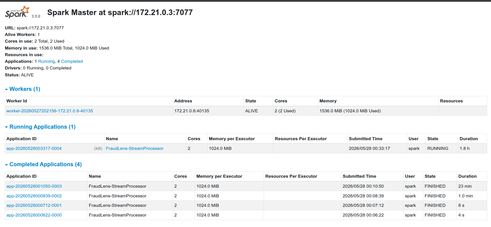

# Spark — Stream Processing Layer

Apache Spark Structured Streaming is the enrichment and routing engine of FraudLens. It consumes
raw transaction events from Kafka, computes two derived features per event — a geographic distance
and a fraud risk score — persists enriched results to three PostgreSQL tables, and routes failed
batches to the Dead Letter Queue. All of this runs continuously in 5-second micro-batches with
exactly-once semantics via checkpointing.

---

## Table of Contents

- [Why Spark Structured Streaming](#why-spark-structured-streaming)
- [Why Micro-batch Over Continuous Processing](#why-micro-batch-over-continuous-processing)
- [Architecture](#architecture)
- [Fraud Scoring Logic](#fraud-scoring-logic)
- [Geographic Distance — Haversine](#geographic-distance--haversine)
- [foreachBatch — Write Strategy](#foreachbatch--write-strategy)
- [Dead Letter Queue Handler](#dead-letter-queue-handler)
- [Checkpointing — Exactly-Once Semantics](#checkpointing--exactly-once-semantics)
- [Unit Tests](#unit-tests)
- [Running the Job](#running-the-job)
- [Monitoring](#monitoring)
- [Folder Structure](#folder-structure)

---

## Why Spark Structured Streaming

Spark treats a stream as an unbounded table. Instead of writing a custom consumer loop that reads
from Kafka, applies transformations, and writes to a database — and then handling retries,
checkpointing, and parallelism yourself — you write a SQL-like transformation once and Spark handles
the continuous execution.

This matters for maintainability. The streaming code in `stream_processor.py` looks almost
identical to a batch transformation: define a schema, parse JSON, apply UDFs, join, filter, write.
The only streaming-specific parts are the `readStream` source and `writeStream` sink. Everything
in between is standard Spark DataFrame API.

It also matters for correctness. Spark's offset-based checkpointing gives exactly-once processing
semantics out of the box — a guarantee that is extremely difficult to implement correctly from
scratch in a hand-written consumer loop.

---

## Why Micro-batch Over Continuous Processing

Spark offers two streaming execution modes:

**Continuous processing** — latency as low as ~1ms, but still experimental in Spark 3.5, limited
to a subset of operations, and lacks production-grade exactly-once guarantees.

**Micro-batch** — processes accumulated events in discrete intervals (5 seconds in FraudLens),
gives exactly-once semantics through Kafka offset checkpointing, and supports the full Spark SQL
and DataFrame API.

FraudLens uses micro-batch with a **5-second trigger**. A fraud alert that fires within 5 seconds
of a transaction is faster than any human review process — and far faster than the 24-48 hours a
traditional batch system would take. The 5-second latency is an acceptable trade for the
operational stability, lower CPU usage (~40% vs continuous), and full exactly-once guarantees that
micro-batch provides.

---

## Architecture

```
Kafka: raw_transactions (3 partitions)
        │
        │  Spark readStream (Kafka source)
        │  startingOffsets = 'latest'
        ▼
Parse JSON → RAW_SCHEMA (23 fields)
        │
        │  Transformations (UDFs)
        ▼
Enriched DataFrame:
  + trans_at       (parsed timestamp)
  + distance_km    (Haversine: customer home ↔ merchant)
  + risk_score     (weighted rule engine)
  + alert_reason   (human-readable explanation)
  + hour_of_day    (time feature)
        │
        │  foreachBatch (every 5 seconds)
        ▼
  ┌─────────────────────────────────────────────────────┐
  │  Write ALL rows  →  stream_staging (full debug row) │
  │  Write ALL rows  →  transactions   (lean fact row)  │
  │  Write FRAUD rows → fraud_alerts   (is_fraud=1      │
  │                                     OR score≥0.7)   │
  └─────────────────────────────────────────────────────┘
        │
        │  On write failure
        ▼
  dlq_transactions (Kafka DLQ)
```

---

## Fraud Scoring Logic

Each transaction receives a `risk_score` between 0.0 and 1.0 computed as a weighted sum of three
independent signals. The weights are tuned so that high-amount transactions and geographically
distant transactions each contribute equally (0.4 each), while merchant category risk is a softer
signal (0.2).

```
risk_score = (0.4 × amount_score) + (0.4 × distance_score) + (0.2 × category_score)
```

### Amount score

| Transaction amount | Score |
|---|---|
| > $1,000 | 1.0 |
| > $500 | 0.7 |
| > $200 | 0.4 |
| Otherwise | 0.1 |

Large transactions are statistically over-represented in fraud cases. A $1,200 grocery purchase
is more suspicious than a $12 one regardless of where it happened.

### Distance score

| Distance (customer home → merchant) | Score |
|---|---|
| > 500 km | 1.0 |
| > 200 km | 0.7 |
| > 50 km | 0.3 |
| Otherwise | 0.0 |

Geographic distance is computed using the **Haversine formula** on the customer's registered home
coordinates (`lat`, `long`) and the merchant coordinates (`merch_lat`, `merch_long`). A transaction
occurring 700km from the customer's home address is a strong fraud signal regardless of amount.

### Category score

| Merchant category | Score |
|---|---|
| `shopping_net`, `misc_net`, `grocery_pos`, `shopping_pos`, `misc_pos` | 0.6 |
| `entertainment`, `gas_transport`, `food_dining` | 0.3 |
| Everything else | 0.1 |

Online shopping and miscellaneous network transactions have historically higher fraud rates in the
Sparkov dataset. This signal is the softest of the three (weight 0.2) because category alone is
not a reliable predictor without corroborating signals.

### Alert threshold

A fraud alert is written to `fraud_alerts` when:

- `is_fraud = 1` (ground truth label from the dataset), **or**
- `risk_score >= 0.7` (rule engine prediction)

The two conditions are intentionally separate. Storing both ground truth and rule-engine predictions
in the same table makes it possible to calculate **precision** and **recall** in the OLAP layer:
how often the rule engine fires when `is_fraud = 1`, and how often it fires falsely when
`is_fraud = 0`.

### Alert reason

Each alert carries a human-readable `alert_reason` string built by `build_alert_reason`:

```
"high amount $1,245.00 | distance 612.3 km from home | high-risk category: shopping_net"
```

This is what appears in the "Recent Fraud Alerts" panel on the Grafana Business Dashboard.

---

## Geographic Distance — Haversine

`jobs/utils/geo_utils.py` implements the Haversine formula for computing great-circle distance
between two points on Earth given their latitude and longitude:

```python
def haversine_km(lat1, lon1, lat2, lon2) -> float:
    R = 6371.0  # Earth radius in km
    dlat = radians(lat2 - lat1)
    dlon = radians(lon2 - lon1)
    a = sin(dlat/2)**2 + cos(radians(lat1)) * cos(radians(lat2)) * sin(dlon/2)**2
    return R * 2 * asin(sqrt(a))
```

This is registered as a Spark UDF:

```python
haversine_udf = udf(haversine_km, FloatType())

enriched = parsed.withColumn(
    "distance_km",
    haversine_udf(col("lat"), col("long"), col("merch_lat"), col("merch_long"))
)
```

Haversine gives accurate distances for the coordinate ranges in the Sparkov dataset (continental
US). For global datasets covering polar regions, the Vincenty formula would be more accurate, but
Haversine is sufficient here and significantly cheaper to compute.

---

## foreachBatch — Write Strategy

`foreachBatch` is Spark's mechanism for applying arbitrary logic to each micro-batch. Instead of
using a built-in sink (JDBC, file, etc.), the function receives the batch DataFrame and an epoch ID,
then writes to PostgreSQL using the JDBC connector.

Each batch writes to three tables:

```python
def write_to_oltp(df, epoch_id):
    # 1. Full debug row for stream_staging
    df.select(...all fields...).write \
      .format("jdbc").option("dbtable", "stream_staging") \
      .mode("append").save()

    # 2. Lean fact row for transactions
    df.select(trans_id, trans_at, unix_time, amount, is_fraud, source="stream") \
      .write.format("jdbc").option("dbtable", "transactions") \
      .mode("append").save()

    # 3. Fraud alerts only
    fraud_df = df.filter((col("is_fraud") == 1) | (col("risk_score") >= 0.7))
    if fraud_df.count() > 0:
        fraud_df.select(trans_id, risk_score, distance_km, alert_reason) \
          .write.format("jdbc").option("dbtable", "fraud_alerts") \
          .mode("append").save()
```

`stream_staging` stores the full enriched row including all raw fields from Kafka. This is useful
for debugging — if a fraud_alert references a transaction with suspicious coordinates, the full
raw payload is immediately available in `stream_staging` without querying Kafka.

---

## Dead Letter Queue Handler

`jobs/utils/dlq_handler.py` is called when any write inside `foreachBatch` raises an exception:

```python
try:
    write_to_oltp(df, epoch_id)
except Exception as exc:
    log.error("Batch %d failed — routing to DLQ", epoch_id)
    send_to_dlq([r.asDict() for r in rows], str(exc))
```

`send_to_dlq` attaches `dlq_reason` and `dlq_timestamp` to each row and publishes them to the
`dlq_transactions` Kafka topic. The original message content is preserved in full — the DLQ is a
lossless audit trail, not just an error count.

---

## Checkpointing — Exactly-Once Semantics

Spark writes checkpoint data to `/opt/spark-apps/checkpoints/oltp_writer` after every successfully
committed micro-batch. The checkpoint records:

- The Kafka offsets that were processed in this batch
- The epoch ID (batch sequence number)
- The write commit state

If the streaming job crashes and restarts, Spark reads the checkpoint and resumes processing from
the last committed Kafka offset. Messages from committed batches are not reprocessed. Messages from
the in-progress batch at crash time are reprocessed exactly once. This is the "exactly-once"
guarantee.

The checkpoint directory is mounted as a Docker volume so it survives container restarts:

```yaml
volumes:
  - ./spark:/opt/spark-apps
```

---

## Unit Tests

`tests/test_fraud_scorer.py` contains 11 unit tests covering all three utility modules. They run
without a live Spark cluster — just Python and pytest:

```bash
pytest spark/tests/ -v
```

| Test class | Tests | What they verify |
|---|---|---|
| `TestHaversine` | 3 | Same-point = 0, Cairo-Alexandria ~175km, returns float |
| `TestRiskScore` | 4 | High-risk scenario ≥ 0.8, low-risk < 0.3, bounded 0–1, medium range |
| `TestAlertReason` | 4 | Distance appears in reason, amount appears, category appears, default fallback |

All 11 tests pass. They also run automatically in CI on every pull request — see
[.github/workflows/](../.github/workflows/).

---

## Running the Job

```bash
make spark-submit
```

This submits `stream_processor.py` to the Spark cluster with the PostgreSQL JDBC driver and Kafka
connector packages pre-loaded from the `.ivy2` cache:

```
org.apache.spark:spark-sql-kafka-0-10_2.12:3.5.1
org.postgresql:postgresql:42.7.3
```

Monitor at **http://localhost:8080** (Spark Master UI) — the job appears under Running Applications
with throughput and batch duration metrics.



---

## Monitoring

| What to check | Where to look |
|---|---|
| Running applications and batch duration | http://localhost:8080 (Spark Master UI) |
| Events/sec rate | Grafana Pipeline Health → `fraudlens_events_per_second` |
| DLQ depth | Grafana Pipeline Health → `fraudlens_dlq_depth` |
| Stream row count | Grafana Pipeline Health → "Stream Rows Received" |
| Fraud alert count | Grafana Pipeline Health → "Fraud Alerts (total)" |
| Worker logs | `docker compose logs spark-worker -f` |

---

## Folder Structure

```
spark/
├── jobs/
│   ├── stream_processor.py        # main streaming job — entry point
│   └── utils/
│       ├── fraud_scorer.py        # compute_risk_score + build_alert_reason
│       ├── geo_utils.py           # haversine_km
│       └── dlq_handler.py         # send_to_dlq
├── tests/
│   └── test_fraud_scorer.py       # 11 unit tests — no Spark cluster needed
├── checkpoints/
│   └── oltp_writer/               # Kafka offset checkpoint (gitignored)
└── spark_README.md
```

---

*Back to root → [README.md](../README.md)*  
*Related → [kafka/kafka_README.md](../kafka/kafka_README.md) · [airflow/README.md](../airflow/README.md)*